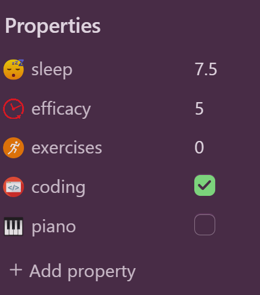
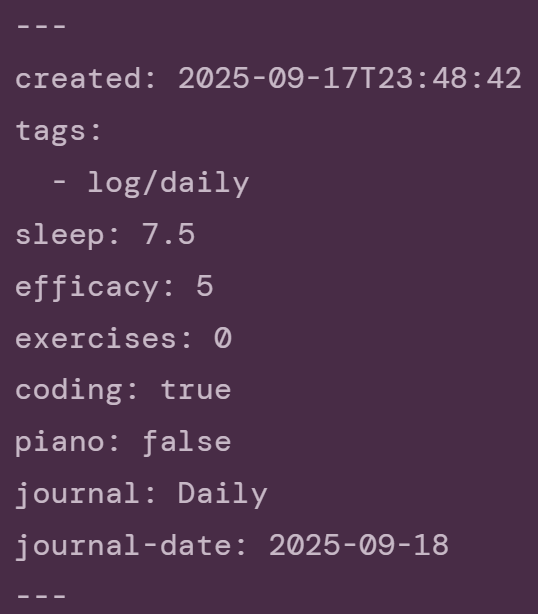

# Property hider for [Obsidian.md](https://obsidian.md)
Hides *individual* metadata properties in
- notes (live preview and reading view),
- and file properties view (core plugin "Properties View")

Features:
- simple configuration in plugin settings with a quick on/off switch
- keyboard shortcuts to quickly toggle visibility of each property

  

## Example
Here's an example of my daily note

    
    

### The one on the _right_ is much more readable, isn't it?
That's what this plugin is for: removing the unnecessary noise without limiting accessibility, allowing you to focus only on the properties that truly matter.

P.S. Don't worry, all your properties are still there and unchanged, just hidden from view.  

  

## Usage
1. Go to plugin settings
2. Add a property
3. Toggle visibility of that property using either the button in plugin settings, or a keyboard shortcut

  

## Roadmap
- [ ] add option to toggle visibility of
    - [ ] all configured properties at once
    - [ ] the entire properties section at once
    - [ ] the "Properties" section name
    - [ ] the "Add property" button
    - [ ] the property icons
    - [ ] the property names? (if you have custom property icons like I do)
- [ ] per-note properties visibility (might be tricky)

  

## Manually building the plugin
- `npm i`
- `npm run build` -> creates `main.js` from `main.ts`
- or `npm run dev` -> automatically recreates `main.js` every time you save `main.ts`
